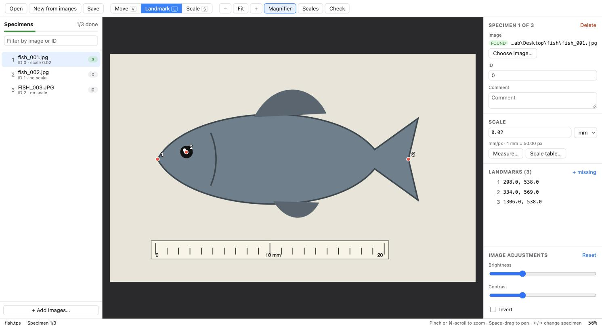

# TPS View

**Website & download: https://echeverri222.github.io/tps-view/**



An open-source, modern landmark digitizer for **`.tps` files**: a replacement for tpsDig2 that runs natively on **macOS**, as well as Windows and Linux.

Files saved by TPS View stay compatible with tpsDig2, tpsUtil, tpsRelw, MorphoJ and R (`geomorph::readland.tps`).

## Features (v0.1)

- **Open and save `.tps` files.** Supports `LM`, `LM3`, `CURVES`, `OUTLINES`, `VARIABLES`, `IMAGE`, `ID`, `SCALE`, `COMMENT`, and unknown keywords, which are kept as-is.
  - Tolerant of messy files: Windows line endings, lowercase keywords, decimal commas, truncated blocks.
- **Choose each specimen's image.** Pick the exact image file for any specimen.
  - Windows paths such as `C:\data\fish_01.JPG` are found automatically next to the `.tps` file.
  - Missing images can be relinked in bulk from a folder.
- **New from images.** Create a TPS file from a set of images (like tpsUtil's *Build tps from images*), or add images to an existing file.
- **Digitize landmarks.**
  - Click to place, drag to move, and delete.
  - Mark landmarks as missing (`-1 -1`).
  - Unlimited undo and redo.
- **Scale tool.** Click both ends of a ruler and type its real length to set `SCALE`.
  - Apply the scale to one specimen, all specimens, or only those without one.
- **Scale table.** Lists every specimen's `SCALE`, with inline editing, bulk apply, and copying the table to Excel.
- **Navigation.**
  - Pinch to zoom, two-finger pan, and a magnifier loupe for sub-pixel precision.
  - Brightness, contrast and invert adjustments.
- **Dataset check.** Flags inconsistent landmark counts, missing landmarks, missing images or scales, and duplicate IDs.
- **CSV export**, in pixels or scaled units.
- **Desktop integration.** Open files by double-clicking a `.tps`, or drag and drop files and images onto the window.

## Download

Download the latest installer from the [website](https://echeverri222.github.io/tps-view/) or the [Releases](https://github.com/Echeverri222/tps-view/releases/latest) page:

| System | File |
|---|---|
| macOS (Apple Silicon + Intel) | `TPS.View_x.y.z_universal.dmg` |
| Windows | `.msi` or `-setup.exe` |
| Linux | `.AppImage` or `.deb` |

### Opening the app for the first time on macOS

The app isn't signed with a paid Apple Developer ID yet, so macOS blocks it the first time you open it:

1. Open the `.dmg` and drag **TPS View** to **Applications**.
2. Open TPS View. When macOS says it can't verify the developer, click **Done**.
3. Go to **System Settings → Privacy & Security**, scroll down, and click **Open Anyway** next to TPS View.

If macOS says the app *"is damaged"*, run this once in Terminal instead:

```sh
xattr -cr "/Applications/TPS View.app"
```

## Keyboard shortcuts

| Key | Action |
|---|---|
| `L` / `V` / `S` | Landmark / Move / Scale tool |
| `←` `→` (or PageUp/PageDown) | Previous / next specimen |
| `↑` `↓` | Select previous / next landmark |
| `⌫` | Delete the selected landmark |
| `M` | Toggle the magnifier |
| `F` or `⌘0` | Fit the image to the window |
| `⌘1` | Actual pixels |
| Space + drag, right-drag | Pan |
| Pinch or `⌘` + scroll | Zoom |
| `⌘Z` / `⇧⌘Z` | Undo / redo |
| `⌘T` | Scale table |
| `⌘I` | Choose the image for the current specimen |

## Notes on the TPS format

- **Coordinates are in pixels, with the origin at the bottom-left of the image** (tpsDig convention). TPS View converts between this and screen coordinates, so files open with points in the same place as in tpsDig.
- **`SCALE` is in units per pixel.** The unit itself (mm, µm…) isn't stored in the file; the unit picker in TPS View only affects what's shown on screen.
- **Missing landmarks** are written as negative coordinates (`-1.00000 -1.00000`). Use `readland.tps(..., negNA = TRUE)` in geomorph.
- **New `IMAGE=` values are written relative to the `.tps` file** (for example `fish_01.jpg` or `images/fish_01.jpg`), so a dataset folder can be moved between computers.

## Development

Requirements: [Node.js](https://nodejs.org) 20+ and [Rust](https://rustup.rs). On Linux you also need the [Tauri system dependencies](https://v2.tauri.app/start/prerequisites/).

```sh
npm install
npm run dev        # run the app with hot reload
npm test           # unit tests for the TPS parser/writer
npm run build      # build installers into app/src-tauri/target/release/bundle/
```

**Browser preview:** while `npm run dev` is running, you can also open http://localhost:1420 in a normal browser. A fake backend (`app/src/devmock.ts`) opens `examples/fish/fish.tps` and keeps saves in memory, which is handy for UI work and automated testing.

Project layout:

```
packages/tps-core/   TPS parser, writer and utilities (pure TypeScript, no UI), with tests
app/                 Desktop app: React + TypeScript UI
app/src-tauri/       Tauri (Rust) shell: file access, native menus, bundling
fixtures/            Sample .tps files used by the tests
examples/            Example dataset (synthetic fish photos + .tps)
docs/                Website (GitHub Pages)
```

### Releasing

Push a version tag. GitHub Actions builds the installers for all platforms and publishes them as a GitHub Release. The website's download button always points at the latest one:

```sh
git tag v0.1.0 && git push origin v0.1.0
```

To remove the macOS Gatekeeper warning, add Apple Developer ID secrets and uncomment the lines in `.github/workflows/release.yml`.

## Roadmap

- **v0.2**
  - Digitize and edit curves, resampled into semilandmarks
  - Outlines
  - Landmark templates: names and a reference picture for each landmark
  - Image thumbnails
- **v0.3**
  - Merge and split TPS files
  - Reorder specimens
  - Distance and angle measurement tool
  - Crash recovery
- **Later**
  - 3D (`LM3`) viewer
  - Homebrew cask
  - Automatic landmark suggestions

Contributions are welcome! Real-world `.tps` files that don't open correctly are especially valuable. Please open an issue and attach them.

## License

MIT. TPS View is an independent project and isn't affiliated with the tps series software by F. James Rohlf.
